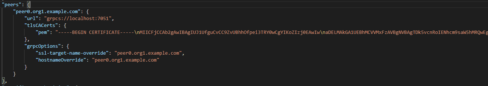
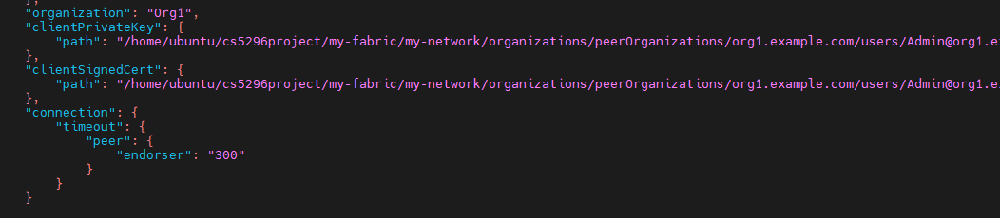
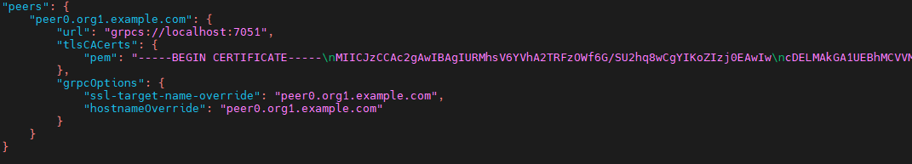
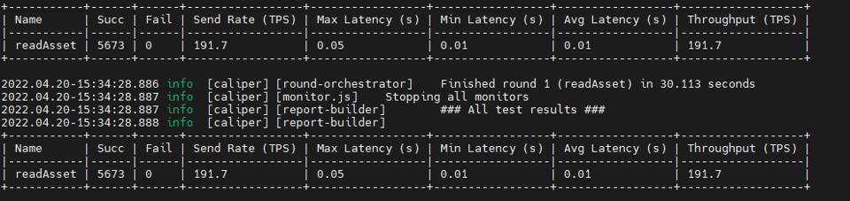

# Hyperledger and Hyperledger Caliper

## Testing Environment
    Ubuntu 20.04

## Prerequisite software

### Install Git
    sudo apt install git

### Install curl
    sudo apt-get install curl

### Install nodejs and npm
    sudo apt install nodejs npm

### Install docker-compose
    sudo apt-get -y install docker-compose

### Start the docker
"username" is mean your user accout (e.g. ubuntu)  
```
sudo systemctl start docker
sudo systemctl enable docker
sudo usermod -a -G docker <username>
```

### fabric-peer, fabric-orderer, fabric-tools
Please install the last version of fabric-peer, fabric-orderer, fabric-tools  
```
sudo docker pull hyperledger/fabric-peer:2.4
sudo docker tag hyperledger/fabric-peer:2.4 hyperledger/fabric-peer:latest
sudo docker pull hyperledger/fabric-orderer:2.4
sudo docker tag hyperledger/fabric-orderer:2.4 hyperledger/fabric-orderer:latest
sudo docker pull hyperledger/fabric-tools:2.4
sudo docker tag hyperledger/fabric-tools:2.4 hyperledger/fabric-tools:latest
```

### Pull the Repository
    git clone https://github.com/vvincentKung/cs5296Hyperledger.git

## Start up the network

1. Initialize the network
    ```
    cd cs5296Hyperledger/my-fabric/my-network/
    sudo ./network.sh up createChannel -c mychannel -ca
    ```

2. Initialize the chaincode
    ```
    cd ../asset-transfer-basic/chaincode-typescript
    npm install && npm run build
    ```

3. Bind the chaincode to the network
    ```
    cd ../../my-network/
    sudo ./network.sh deployCC -ccn basic -ccp ../asset-transfer-basic/chaincode-typescript/ -ccl typescript
    ```

4. After the chaincide is binded to the network, some new files would be created. These files are used for Hyperledger Caliper testing. We need to  change the permission of these files,
    ```
    sudo chmod -R ugo+rwx organizations/peerOrganizations/org1.example.com/users/
    ```

## Set up and Run Hyperledger Caliper

1. copy the path of "clientPrivateKey", it looks like:
    ```
    /home/ubuntu/cs5296Hyperledger/my-fabric/my-network/organizations/peerOrganizations/org1.example.com/users/Admin@org1.example.com/msp/keystore/1b36cb0a419b4d0ad7e8ba35c613cbe76cc9336d32dc4d15cac6c35dce6076bc_sk
    ```

2. Open `/home/ubuntu/cs5296Hyperledger/my-fabric/my-network/organizations/peerOrganizations/org1.example.com/connection-org1.json`, copy the "pem" of "peer0.org1.example.com", it looks like this:  
    

3. Go to ../../caliper-workspace

    ```
    cd ../../caliper-workspace
    ```

4. Initial workspace
    ```
    npm install
    ```

5. Install hyperledger/caliper-cli
    ```
    npm install --only=prod @hyperledger/caliper-cli@0.4.0
    npx caliper bind --caliper-bind-sut fabric:2.1
    ```

6. Replace the "clientPrivateKey" and "pem" in `networks/networkConfig.json`,  
    * clientPrivateKey  
    
    * pem  
    

7. Run the testing script (readAsset.js) to test the performance of the network,

    ```
    npx caliper launch manager --caliper-workspace ./ --caliper-networkconfig networks/networkConfig.json --caliper-benchconfig benchmarks/myAssetBenchmark.yaml --caliper-flow-only-test --caliper-fabric-gateway-enabled --caliper-fabric-gateway-discovery
    ```

8. The Result looks like this:  
    

## Shut down the network
    cd ../my-fabric/my-network/
    ./network.sh down
